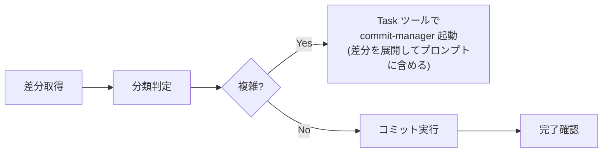

# Commit Diffs Expert

> **核心原則**: 1コミット＝1つの論理的変更。原子性・レビュー容易性・履歴可読性を最大化する。

## 判断基準: スキル vs サブエージェント

```
IF 単純なケース（以下すべて該当）:
├─ 変更ファイル: 3つ以下
├─ カテゴリ: 単一（feat/fix/refactorなど）
├─ 依存関係: なし（各変更が独立）
└─ → スキル内で完結（下記クイックフローに従う）

IF 複雑なケース（以下いずれか該当）:
├─ 変更ファイル: 4つ以上
├─ カテゴリ: 複数混在（feat + refactor など）
├─ 依存関係: あり（変更間に順序依存）
├─ 50行以上の大規模差分
└─ → `git diff` を取得し、Task ツールで commit-manager サブエージェントを起動
   ※ 差分の実内容をプロンプトに展開してから呼び出すこと
```

## クイックフロー（単純なケース）



### Step 1: 差分取得と判定

```bash
git diff --stat
git diff
```

**判定**:
| 状態 | 判断 | アクション |
|------|------|------------|
| 変更なし | 終了 | 「コミット対象の変更がありません」と報告 |
| 4ファイル以上 | 複雑 | `git diff` を取得し Task ツールで `commit-manager` を起動 |
| 複数カテゴリ混在 | 複雑 | `git diff` を取得し Task ツールで `commit-manager` を起動 |
| 単純 | 続行 | Step 2へ |

### Step 2: カテゴリ特定

[classification.md](classification.md) を参照し、変更のカテゴリを特定する。

### Step 3: コミット実行

```bash
git add <対象ファイル>
git commit -m "$(cat <<'EOF'
[カテゴリ]: 概要

本文（何を/なぜ変えたか）
EOF
)"
```

### Step 4: 完了確認

```
コミット完了:

- カテゴリ: [カテゴリ]
- 概要: [概要]
- ファイル: [対象ファイル]
- コミットハッシュ: [hash]
```

## サブエージェント起動（複雑なケース）

複雑なケースと判定したら、**Task ツール**で `commit-manager` サブエージェントを起動する。

### Task ツール呼び出しパラメータ

```json
{
  "subagent_type": "commit-manager",
  "description": "差分分析・分割コミット",
  "prompt": "以下の差分を分析し、最適な粒度でコミットを分割・実行してください。\n\n【差分サマリー】\n{git diff --stat の結果をここに展開}\n\n【詳細差分】\n{git diff の結果をここに展開}\n\n【依頼内容】\n1. 変更を分類し依存関係を特定する\n2. Multi-Aspect Scoring で分割案を評価する\n3. コミット計画をユーザーに提示し、承認後に実行する\n\n【参照スキルファイル】\n.cursor/skills/commit-diffs/classification.md\n.cursor/skills/commit-diffs/evaluation.md\n.cursor/skills/commit-diffs/patterns.md\n.cursor/skills/commit-diffs/templates.md"
}
```

### 起動前に埋める変数

| 変数 | 取得コマンド |
|------|-------------|
| `{git diff --stat の結果}` | `git diff --stat` |
| `{git diff の結果}` | `git diff` |

> **重要**: プロンプト内に差分の実内容を展開してから Task ツールを呼び出すこと。サブエージェントはシェルを持つが、コンテキストは引き継がれないため、差分データを必ずプロンプトに含める。

## 詳細参照

| シーン | 参照ファイル |
|--------|-------------|
| 変更カテゴリの定義 | [classification.md](classification.md) |
| Multi-Aspect Scoring基準 | [evaluation.md](evaluation.md) |
| 分割パターンとサンプル | [patterns.md](patterns.md) |
| 出力テンプレート | [templates.md](templates.md) |
