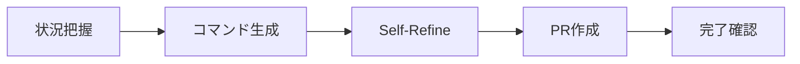
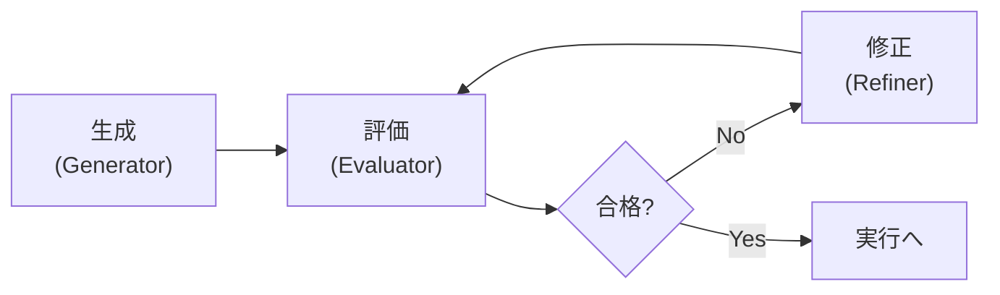

# PR Creation Expert

> **核心原則**: レビュアーは忙しい。「読みたい」と思っていない前提で、読んでもらう努力をする。

## 判断基準: スキル vs サブエージェント

```
IF 単純なケース（以下すべて該当）:
├─ ブランチ: feature/{codename}/00-* または fix/* または hotfix/*
├─ ベースブランチ: main
├─ 依存PR: なし
└─ → スキル内で完結（下記フローに従う）

IF 複雑なケース（以下いずれか該当）:
├─ ブランチ: feature/{codename}/{NN}-*（NN > 00）
├─ ベースブランチ: 前の連番ブランチ
├─ 依存PR: あり
├─ マルチパッケージ変更
└─ → pr-manager サブエージェントを起動
```

## クイックフロー（単純なケース）



### Step 1: 状況把握

```bash
git branch --show-current  # 現在のブランチ名
git status --short         # 未コミットの変更確認
git log --oneline -3       # 最新のコミット確認
```

**判断**:
| 状態 | 判断 | アクション |
|------|------|------------|
| ブランチ名が取得できない | エラー | 処理終了、ユーザーに報告 |
| 未コミットの変更がある | 警告 | ユーザーに確認を求める |
| コミットがない | 警告 | ユーザーに確認を求める |

### Step 2: コマンド生成

[templates.md](templates.md) のテンプレートを使用してPR本文を作成。
[decision-logic.md](decision-logic.md) でベースブランチ・タイトルを決定。

### Step 3: Self-Refine（自己評価）

コマンドを実行する**前に**、[safety-checks.md](safety-checks.md) に従って評価。



**重要**: 評価結果を表示し、問題がなければ「評価完了」と宣言して実行に進む。

### Step 4: PR作成

```bash
cat <<'EOF' | gh pr create \
  --draft \
  --base main \
  --assignee @me \
  --title "<タイトル>" \
  --body-file -
<本文>
EOF
```

### Step 5: 完了確認

```
PR作成完了:

- Title: <タイトル>
- URL: https://github.com/org/repo/pull/123
- Base: main
- Draft: true
- Assignee: @me
```

**確認チェックリスト**:
- [ ] PRがドラフトモードで作成されている
- [ ] ベースブランチが正しい
- [ ] アサインが設定されている

## サブエージェント起動テンプレート

複雑なケースでは以下のプロンプトで `pr-manager` サブエージェントを起動:

```
【タスク】
PR作成

【現在のブランチ】
{git branch --show-current の結果}

【最新コミット】
{git log --oneline -5 の結果}

【期待する出力】
- 依存PRの特定と関連付け
- 適切なベースブランチの決定
- PR本文の生成
- ghコマンドの実行
```

## 詳細参照

| シーン | 参照ファイル |
|--------|-------------|
| 本文・タイトルテンプレート | [templates.md](templates.md) |
| ベースブランチ・依存PR決定 | [decision-logic.md](decision-logic.md) |
| クォーティング・Self-Refine | [safety-checks.md](safety-checks.md) |

## 設定項目（固定）

| 項目 | 値 | 理由 |
|------|-----|------|
| ドラフトモード | 有効 | レビュー前の準備期間を確保 |
| アサイン | 作成者（@me） | 責任者の明確化 |
| レビュー依頼 | なし | ドラフト解除時に設定 |
