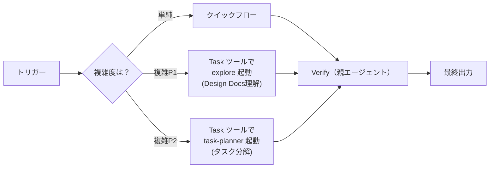

# Task Breakdown Skill

> **核心**: Design Docsを実装可能な単位に分解し、整合性のあるブランチ戦略を策定する

## ワークフロー



## 判断基準: スキル vs サブエージェント

```
IF 単純なケース（以下すべて該当）:
├─ Design Docs: 1セクション以内
├─ 予想タスク数: 3以下
├─ 依存関係: 直線的（A→B→C）
└─ → スキル内で完結（クイックフローに従う）

IF 複雑なケース（以下いずれか該当）:
├─ Design Docs: 複数セクション or 大規模
├─ 予想タスク数: 4以上
├─ 依存関係: 分岐あり or 複雑
├─ コードベースの影響調査が必要
└─ → Task ツールでサブエージェントを起動（下記参照）
   ※ Phase 1（理解）→ explore, Phase 2（分解）→ task-planner
```

## クイックスタート

### 入力

- Design Docs（ファイルパスまたは内容）
- 達成したいスコープ（任意）

### 現在地判断

```
何をする？
├─ Design Docsの内容を理解したい
│   → Phase 1: Understand
│   → 参照: phases/understand.md
│
├─ タスクに分解してブランチ戦略を決めたい
│   → Phase 2: Decompose（サブエージェント推奨）
│   → 参照: phases/decompose.md
│
└─ 分解結果を検証・調整したい
    → Phase 3: Verify（親エージェント実行）
    → 参照: phases/verify.md
```

## フェーズ概要

| フェーズ | 内容 | 実行者 | 参照 |
|---|---|---|---|
| Understand | Design Docs理解 + スコープ特定 | 単純→親 / 複雑→`explore` | [phases/understand.md](phases/understand.md) |
| Decompose | タスク分解 + 依存関係 + ブランチ戦略 | 単純→親 / 複雑→`task-planner` | [phases/decompose.md](phases/decompose.md) |
| Verify | Self-refine検証 + ユーザー承認 | 親エージェント | [phases/verify.md](phases/verify.md) |

## サブエージェント起動（複雑なケース）

### Phase 1: explore（Design Docs理解）

Design Docsが大規模 or コードベース探索が必要な時に **Task ツール**で `explore` を起動する。

#### Task ツール呼び出しパラメータ

```json
{
  "subagent_type": "explore",
  "description": "Design Docs理解とスコープ特定",
  "model": "fast",
  "prompt": "以下のDesign Docsを精読し、実装スコープを特定してください。\n\n【調査対象】\n- Design Docs: {design-docsのファイルパス}\n- 関連ディレクトリ: {影響が予想されるパッケージ、不明なら空欄}\n- 関連キーワード: {検索キーワード、不明なら空欄}\n\n【出力内容】\n\n#### Design Docs要約\n| 項目 | 内容 |\n|---|---|\n| 背景・課題 | [記述] |\n| ゴール | [記述] |\n| 主要概念 | [概念1], [概念2] |\n| 技術的決定 | [決定]: [理由] |\n\n#### 実装スコープ\n| カテゴリ | 内容 |\n|---|---|\n| IN SCOPE | [機能1], [機能2] |\n| OUT OF SCOPE | [機能1] |\n| 変更対象 | `packages/xxx` |\n| 新規作成 | `path/to/file.ts` |\n\n#### 関連ファイル一覧\n- [ファイルパス]: [役割]\n\n【調査の深さ】thoroughness: \"medium\""
}
```

#### 起動前に埋める変数

| 変数 | 取得方法 |
|------|----------|
| `{design-docsのファイルパス}` | ユーザー入力またはGlobで探索 |
| `{影響が予想されるパッケージ}` | Design Docsから読み取り |
| `{検索キーワード}` | Design Docsの主要概念から抽出 |

> **詳細テンプレート**: [subagent-prompts/explore-design-docs.md](subagent-prompts/explore-design-docs.md)

---

### Phase 2: task-planner（タスク分解）

タスク数4以上 or 依存関係が複雑な時に **Task ツール**で `task-planner` を起動する。

#### Task ツール呼び出しパラメータ

```json
{
  "subagent_type": "task-planner",
  "description": "タスク分解・ブランチ戦略設計",
  "prompt": "以下の情報からタスク分解とブランチ戦略を策定してください。\n\n【Design Docs要約】\n{Phase 1の「Design Docs要約」をここに展開}\n\n【実装スコープ】\n{Phase 1の「実装スコープ」をここに展開}\n\n【期待する出力】\n1. タスク一覧（# / タスク名 / 概要 / 見積もり / 検証方法）\n2. 依存関係グラフ（Mermaid）\n3. ブランチ戦略表（ブランチ / 親ブランチ / 対応タスク / マージ順）\n4. 整合性チェック（先行タスクと親ブランチの一致確認）\n\n【制約】\n- PR差分300行以内/タスク\n- 命名: feature/{codename}/{nn}-{modifier}（各4単語以内）\n- スタック方式: main → /00 → /01 → /02 → ...\n- 先行タスクと親ブランチは必ず一致させること\n\n【参照スキルファイル】\n.cursor/skills/task-breakdown/phases/decompose.md\n.cursor/skills/task-breakdown/phases/verify.md\n.cursor/skills/task-breakdown/templates/output.md"
}
```

#### 起動前に埋める変数

| 変数 | 取得元 |
|------|--------|
| `{Phase 1の「Design Docs要約」}` | explore サブエージェントの出力 or 親エージェントの分析結果 |
| `{Phase 1の「実装スコープ」}` | explore サブエージェントの出力 or 親エージェントの分析結果 |

> **重要**: Phase 1の出力内容をプロンプトに展開してから呼び出すこと。サブエージェントはコンテキストを引き継がないため、必要な情報を全てプロンプトに含める。

> **詳細テンプレート**: [subagent-prompts/plan-tasks.md](subagent-prompts/plan-tasks.md)

## 成果物

1. **タスクブレイクダウン表**: 各タスクの説明、見積もり、依存関係
2. **ブランチ戦略**: 命名規則と親子関係の定義
3. **更新されたDesign Docs**: タスクブレイクダウン情報を含む

## テンプレート

| ファイル | 内容 |
|---|---|
| [templates/output.md](templates/output.md) | 最終出力テンプレート |

## 絶対に守るルール

1. **整合性チェック必須** → 先行タスクと親ブランチは必ず一致
2. **サイズ制約** → 1タスクあたりPR差分300行以内を目安
3. **Self-refine省略禁止** → Phase 3のVerifyは必ず実行
4. **Design Docs PR先行** → `/00-design-docs` ブランチを最初にマージ
