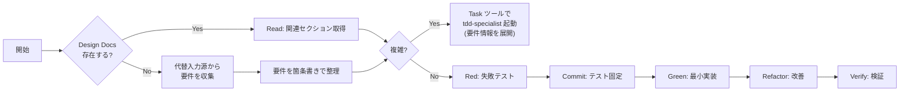

# TDD from Design Docs

> **核心**: 失敗するテストを先に書く。実装はテストを通すためだけに書く。

## Step 0: Design Docs の存在確認

スキル起動直後に必ず確認する。

```
Glob("docs/design-docs/**/*.md") または Read("docs/design-docs/") を試みる

├─ 存在する → 該当セクションを Read して要件を把握 → Step 1へ
└─ 存在しない → 代替入力源から要件を収集 → Step 0-B へ
```

### Step 0-B: 代替入力源からの要件収集

Design Docsがない場合、以下の優先順位で要件を収集する。

| 優先順 | 入力源 | 取得方法 |
|--------|--------|----------|
| 1 | ユーザーの指示・チャット | 現在のコンテキストから読み取る |
| 2 | 既存の型定義・インターフェース | `Glob("packages/**/src/**/*.ts")` → 関連ファイルを `Read` |
| 3 | 既存テストコード | `Glob("**/*.test.ts")` → 同種のテスト構造を参照 |
| 4 | README / パッケージドキュメント | `packages/*/README.md` を `Read` |

収集後、以下を箇条書きで整理してから先へ進む：

```
【収集した要件】
- 目的: {何を実現するか}
- 入力: {受け取るデータ・引数}
- 出力: {返すデータ・副作用}
- 正常系: {期待する動作}
- 異常系: {エラーケース}
```

> Design Docsがない場合でも「収集した要件」が揃えば、以降のフローは同じ。

## 判断基準: スキル vs サブエージェント

```
IF 単純なケース（以下すべて該当）:
├─ テストケース: 2つ以下
├─ 対象ファイル: 1つ
├─ 仕様: 明確（Design Docs または収集した要件から詳細あり）
└─ → スキル内で完結（下記クイックフローに従う）

IF 複雑なケース（以下いずれか該当）:
├─ テストケース: 3つ以上
├─ 対象ファイル: 複数
├─ 仕様: 曖昧または複雑な依存関係あり
├─ 正常系・異常系・境界値の網羅が必要
└─ → Task ツールで tdd-specialist サブエージェントを起動（下記参照）
   ※ Design Docs or 収集した要件をプロンプトに展開してから呼び出すこと
```

## ワークフロー



## クイックフロー（単純なケース）

### 入力

- Design Docs（またはその一部）**または** Step 0-B で収集した要件
- 実装対象のタスク（Task Breakdownから、またはユーザー指示）

### フェーズ判断

```
今どこ？
├─ テストがない → Step 1: Red
├─ テストが失敗中 → Step 3: Green
├─ テストはパスするがコードが汚い → Step 4: Refactor
└─ 全て完了 → Step 5: Verify
```

### 各フェーズの詳細

| フェーズ | 参照ファイル | キーポイント |
|---|---|---|
| Red | [red.md](red.md) | 実装コードを書かない、テストのみ |
| Commit | [red.md](red.md) | 実装前に失敗テストをコミット |
| Green | [green.md](green.md) | 「動く」ことだけを目指す |
| Refactor | [refactor.md](refactor.md) | テストがパスし続けることを常に確認 |
| Verify | [verify.md](verify.md) | オーバーフィッティング検証 |

## コマンドチートシート

```bash
# Step 1: Red
pnpm <pkg> test <file>.test.ts  # 失敗を確認

# Step 2: Commit
git add <file>.test.ts
git commit -m "test: 失敗テストを追加"

# Step 3: Green
pnpm <pkg> test <file>.test.ts  # パスを確認
pnpm <pkg> typecheck

# Step 4: Refactor
pnpm <pkg> test
pnpm <pkg> lint
pnpm <pkg> typecheck

# Step 5: Verify & Commit
git add .
git commit -m "feat: 機能を実装"
```

## サブエージェント起動（複雑なケース）

複雑なケースと判定したら、**Task ツール**で `tdd-specialist` サブエージェントを起動する。

### Task ツール呼び出しパラメータ

**Design Docs あり の場合:**

```json
{
  "subagent_type": "tdd-specialist",
  "description": "TDD実装: {タスク名}",
  "prompt": "Design DocsからTDDで実装を行ってください。\n\n【Design Docs（関連部分）】\n{Design Docsの関連セクションをここに展開}\n\n【実装対象】\n- タスク: {タスク名}\n- パッケージ: {パッケージ名}\n- 対象ファイル: {ファイルパス}\n\n【期待する出力】\n- テストケースの設計と実装\n- Red→Green→Refactorサイクルの実行\n- 各フェーズのコミット\n- 完了報告\n\n【参照スキルファイル】\n.cursor/skills/tdd-from-design-docs/red.md\n.cursor/skills/tdd-from-design-docs/green.md\n.cursor/skills/tdd-from-design-docs/refactor.md\n.cursor/skills/tdd-from-design-docs/verify.md"
}
```

**Design Docs なし の場合（収集した要件を使用）:**

```json
{
  "subagent_type": "tdd-specialist",
  "description": "TDD実装: {タスク名}",
  "prompt": "Design Docsはありませんが、以下の収集済み要件からTDDで実装を行ってください。\n\n【収集した要件】\n- 目的: {何を実現するか}\n- 入力: {受け取るデータ・引数}\n- 出力: {返すデータ・副作用}\n- 正常系: {期待する動作}\n- 異常系: {エラーケース}\n\n【参照した情報源】\n{型定義・既存テスト・READMEなど参照したファイルパスと要約}\n\n【実装対象】\n- タスク: {タスク名}\n- パッケージ: {パッケージ名}\n- 対象ファイル: {ファイルパス}\n\n【期待する出力】\n- テストケースの設計と実装\n- Red→Green→Refactorサイクルの実行\n- 各フェーズのコミット\n- 完了報告\n\n【参照スキルファイル】\n.cursor/skills/tdd-from-design-docs/red.md\n.cursor/skills/tdd-from-design-docs/green.md\n.cursor/skills/tdd-from-design-docs/refactor.md\n.cursor/skills/tdd-from-design-docs/verify.md"
}
```

### 起動前に埋める変数

| 変数 | Design Docs あり | Design Docs なし |
|------|-----------------|-----------------|
| `{タスク名}` | Task Breakdownの出力またはユーザー入力 | 同左 |
| `{パッケージ名}` | Design DocsまたはGlobで探索 | Globで探索 |
| `{ファイルパス}` | Design Docsまたは既存コードから特定 | 既存コードから特定 |
| `{Design Docsの関連セクション}` | ユーザー指定のDesign Docsを Read で取得 | — (使用しない) |
| `{収集した要件}` | — (使用しない) | Step 0-B で収集した内容 |
| `{参照した情報源}` | — (使用しない) | 参照したファイルパスと要約 |

> **重要**: サブエージェントはコンテキストを引き継がないため、Design Docs または収集した要件を必ずプロンプトに展開してから呼び出すこと。

## 絶対に守るルール

1. **Red で実装を書かない** → テストファイルのみ編集
2. **Green で美しさを求めない** → 「動く」だけでOK
3. **Refactor でテストを変えない** → 仕様変更と混同しない
